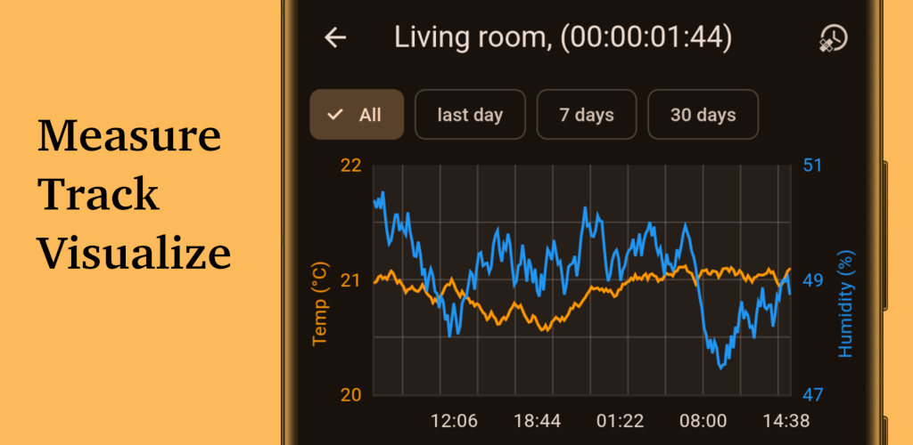

# Mi Thermo Reader

A flutter app for connecting to bluetooth thermometers, then reading and visualizing the stored sensor history. Works for any thermometer using the custom firmware from https://github.com/pvvx/ATC_MiThermometer.

Runs on all platforms available for flutter:

* [Try it on web](https://panmari.github.io/mi_thermo_reader/)
* [On the play store](https://play.google.com/store/apps/details?id=ch.panmari.mi_thermo_reader)
* Or manually install the APK of the [latest release](https://github.com/panmari/mi_thermo_reader/releases/latest)

## Run integration tests

There are integration tests, configured to dump screenshots with a custom driver. Run the command

    flutter drive --target=integration_test/app_test.dart --driver=test_driver/integration_test.dart

## Generate code

Riverpod and proto generators are used for generating some boilerplate code. To regenerate code, run

    dart run build_runner watch

To regenerate the dart code after making changes to protos, use

    protoc --proto_path=lib/proto --dart_out=lib/src/proto lib/proto/model.proto

Full instructions: https://protobuf.dev/reference/dart/dart-generated/
